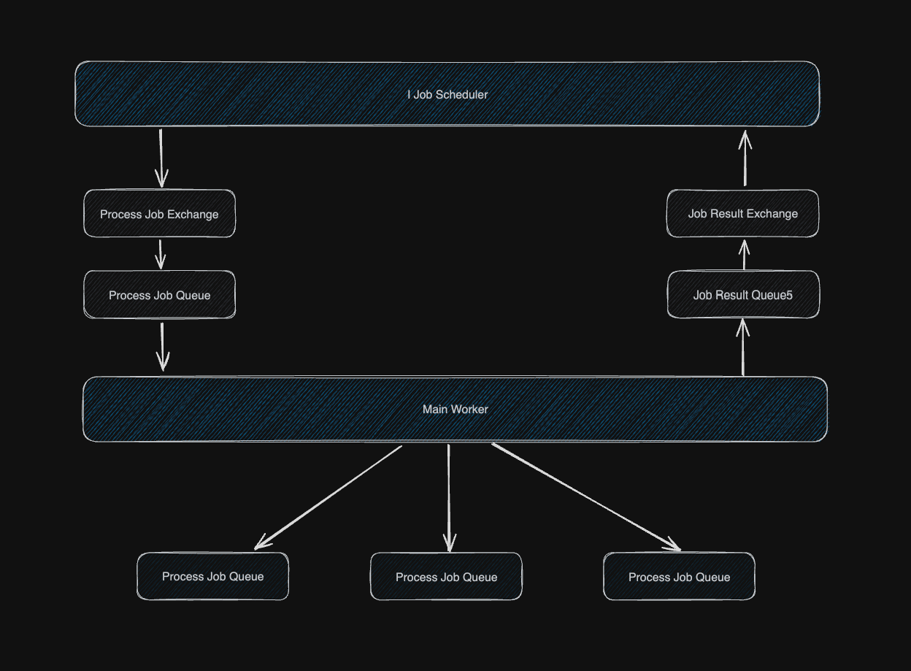

# Worker Scheduler Pattern

> The Worker/Scheduler pattern is a design pattern used to manage background tasks and asynchronous operations in software applications. Here's a breakdown of its definition and key components:

## Structure

## Scheduler

### Features

#### Job definition

#### Job scheduling

#### Persistence

## Worker

#### Job execution